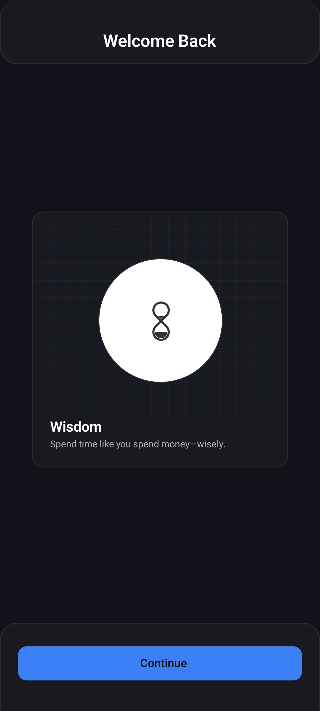
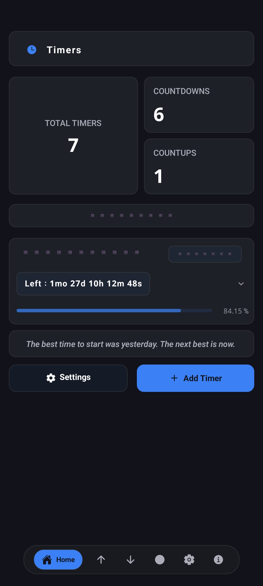
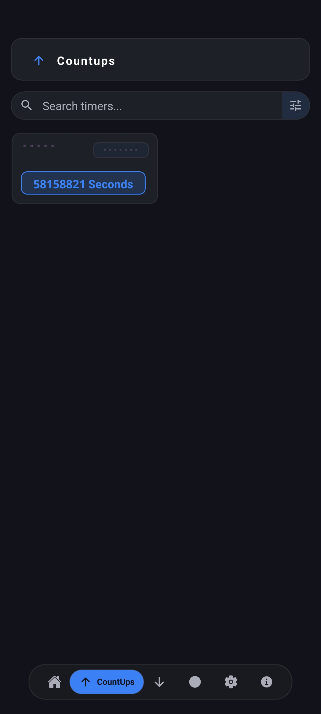
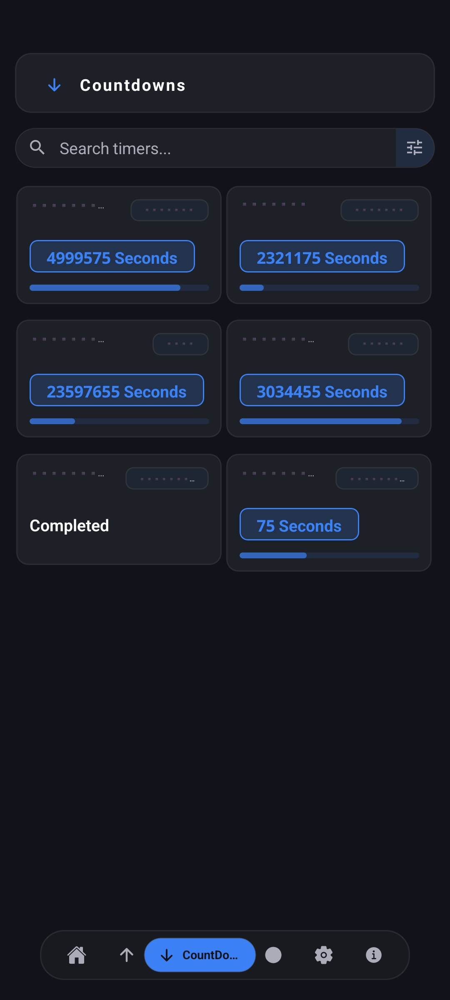
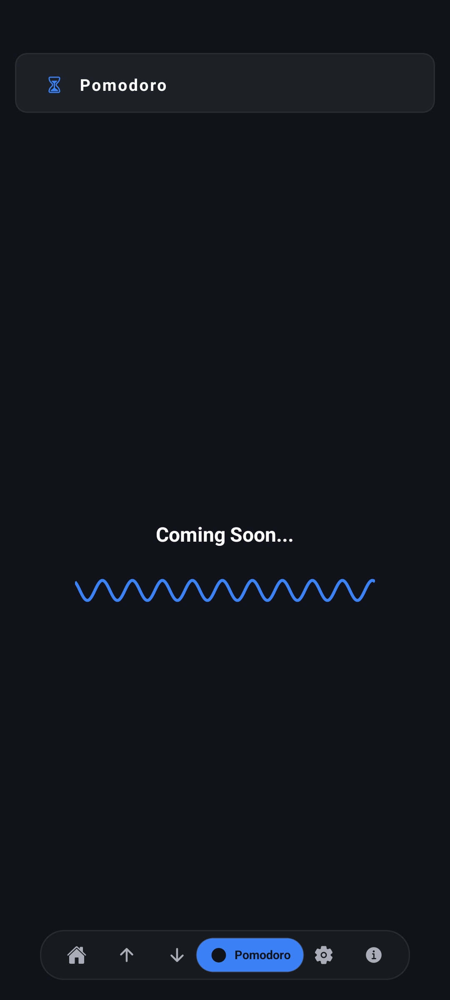
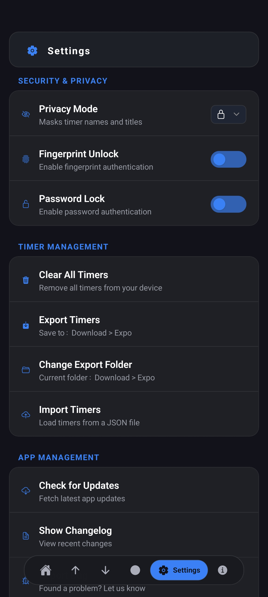
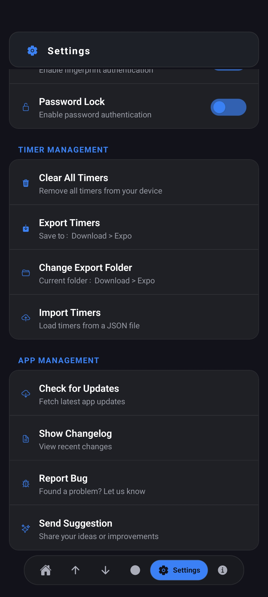
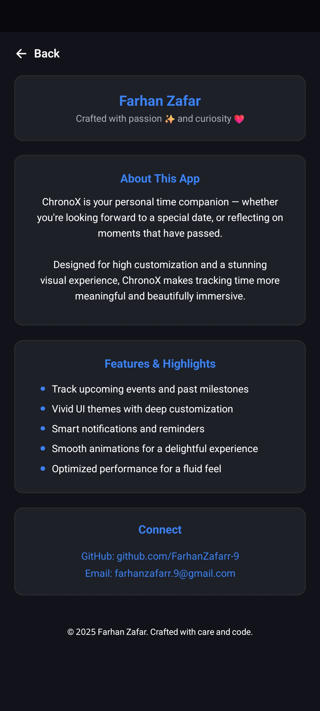
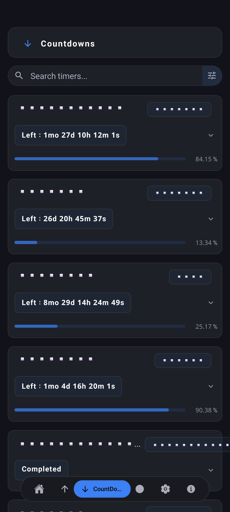

# ⏳ ChronoX (Timers)

**ChronoX** is a sleek, fluid, and deeply customizable time tracking app built with **React Native + Expo**.  
It helps you keep track of how much time is **left _until_ or has _passed since_** any target date — elegantly broken down into **years, months, days, hours, minutes, and seconds.**

---

## 🎯 Purpose

Most countdown or count-up apps are either too cluttered, too plain, or lack the depth of customization modern users crave.  
ChronoX solves this by offering:

- A **soft, immersive UI** that feels easy on the eyes yet vibrant.
- Rich personalization across themes, layouts, accent colors, header navigation, and even borders.
- A dynamic, smooth experience using **carefully chosen transitions and animations**.

---

## 🚀 Features

- ⏱ **Track time from or to any date** with precision across all units (years → seconds).
- 🎨 **Fully customizable appearance:**  
  - Choose between light, dark, or neutral themes.
  - Adjust border styles, accent colors, header & navigation settings.
  - Toggle between grid or list layouts.

- 💫 **Animated UI:**  
  - Subtle transitions and interactions create a smooth, delightful experience.

- 📤 **Export Options:**  
  - Save timer cards as **PNG images** for sharing or journaling.
  - Export all timers in **JSON format** for backups or future imports.

- 🔔 **Future-ready:**  
  - Planned features include smart reminders, widgets, and even richer analytics. ( depends on the mood though)

- ✅ **Feedback-friendly:**  
  - The app integrates meaningful toast & alert feedback to keep you informed.

---

## ✨ Highlights

- 🕶 **Soft UI philosophy:**  
  Rounded corners, gentle shadows, and balanced typography to reduce strain and create a calm experience.

- 🎯 **Rich chip-based time display:**  
  Lets you cycle between the most meaningful units — e.g., from “3 years” to “8 months” left.

- 🌙 **Dark & themed modes:**  
  Tailored for long viewing without fatigue.

- ⚙ **Well-structured codebase:**  
  Built with maintainability and future growth in mind, leveraging Expo’s robust ecosystem.

---

## 🛠️ Tech Stack

- **React Native (Expo)**
- Animated API (React Native)
- Custom hooks & context providers
- SVGs and vector icons
- Expo’s EAS Updates for instant JS bundle delivery

---

## 🗂️ Folder Overview

ChronoX/
├── components/ # Reusable UI components (cards, modals, waves)
├── screens/ # Main app screens (Home, Settings, About, Pomodoro, etc.)
├── utils/ # Theme, data, timer & security context providers
├── assets/ # Icons, images, fonts
├── App.js # Root component
├── app.json # Expo config
└── package.json

---

## 📱 Sample Screens

> _A glimpse into the current design (more screenshots & GIFs soon!)_

  
  
  
  
  
  
  
  
  
  
  

---

## 🔮 Future Plans

- Smart reminders & notifications tied to timers.
- Home screen widgets.
- Animated progress rings or waves.
- Stats & historical insights for completed timers.
- Cross-device sync.

---

## 🧑‍💻 Author

**Farhan Zafar**  
🔗 GitHub: [@FarhanZafarr-9](https://github.com/FarhanZafarr-9)

---

## 🛡️ Disclaimer

ChronoX is a **personal project**, evolving with user needs & feedback.  
It's not linked to any commercial entity, and your data stays secure on your device.  
The app values your privacy — no hidden analytics or data harvesting.

---

## ❤️ Designed for Peace of Mind

Crafted with ❤️, passion ✨ and curiosity by Parzival

